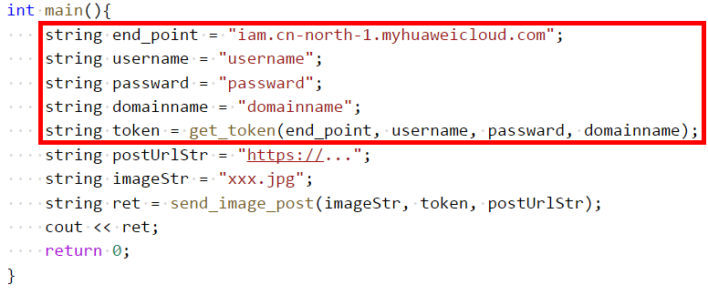
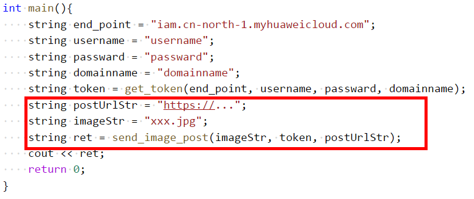
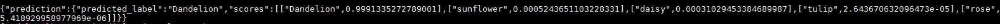

# 利用C++进行模型API预测

## libcurl依赖安装

使用

```
curl --version
```

查看是否安装了curl，如果没有则需要按下面命令进行安装。

使用apt-get安装curl

```
sudo apt-get install libcurl4-openssl-dev
```

或者使用yum

```
sudo yum install libcurl-devel
```

## 预测参数准备

复制并打开c++接口的[示例代码](modelarts_send_image.cpp)。

### 获取用户的Token

在代码中替换如下必须的参数：

**end_point**：获取IAM的Endpoint及消息体中的区域名称，请参见[地区和终端节点](http://developer.huaweicloud.com/endpoint.html)；

**username**：账号名；

**passward**：账号的密码；

**domainname**：主账号名，如果username是主账号的话，这里填写账号的username，如果是子账号则需要填写主账号的username；

将这三个变量传给**get_token()**方法，即可获得账号的**Token**。




### 获取调用接口API的URL

在代码中替换API接口的地址和图片路径：

postUrlStr：API接口地址，例如：https://67815d24d43c41398c395866d69e4599.apigw.cn-north-1.huaweicloud.com/v1/infers/aac33cae-7a9b-44de-bdbd-a97af4f97ab0；

**imageStr**：本地图片地址；

同时传入上面获取的**Token**，来调用**send_image_post()**，即可返回预测到的结果。



## 编译运行

针对modelarts_send_image.cpp文件，使用linux下的**g++**来编译和运行。

### 编译

```
g++ -l curl -o send modelarts_send_image.cpp
```

### 运行

```
./send
```

## 结果

以某个分类模型为例，可以得到如下的json结果



```json
{"prediction":{"predicted_label":"Dandelion","scores":[["Dandelion",0.9991335272789001],["sunflower",0.0005243651103228331],["daisy",0.00031029453384689987],["tulip",2.643670632096473e-05],["rose",5.418929958977969e-06]]}}
```

