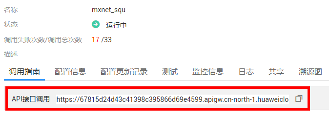
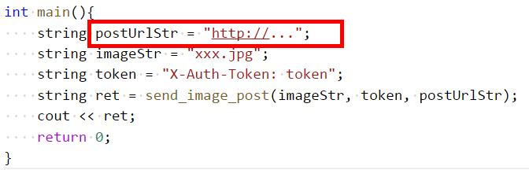
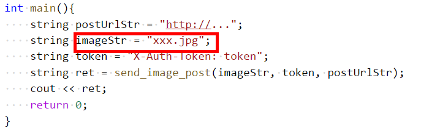

# 利用C++进行模型API预测

## libcurl依赖安装

使用

```
curl --version
```

查看是否安装了curl，如果没有则需要按下面命令进行安装。

使用apt-get安装curl

```
sudo apt-get install libcurl4-openssl-dev
```

或者使用yum

```
sudo yum install libcurl-devel
```

## 预测参数准备

复制并打开c++接口的[示例代码](modelarts_send_image.cpp)。

### 获取调用接口API的URL

如图所示复制这串url即可。



并赋值给示例代码中的postUrlStr变量，




### 获取用户的Token

参考[Token认证](https://support.huaweicloud.com/api-dls/dls_03_0005.html)获取Token，替换如图所示的 “token” 字符即可，**注意：token变量必须要有“X-Auth-Token: ”开头。**


### 传入图片的地址

将图片地址赋值给imageStr变量。



### 调用图片上传的函数

将上述三个变量传给send_image_post函数即可得到返回值。

## 编译运行

针对modelarts_send_image.cpp文件，使用linux下的g++来编译和运行。

### 编译

```
g++ -l curl -o send modelarts_send_image.cpp
```

### 运行

```
./send
```

## 结果

以某个分类模型为例，可以得到如下的json结果


```json
{"prediction":{"predicted_label":"Dandelion","scores":[["Dandelion",0.9991335272789001],["sunflower",0.0005243651103228331],["daisy",0.00031029453384689987],["tulip",2.643670632096473e-05],["rose",5.418929958977969e-06]]}}
```

